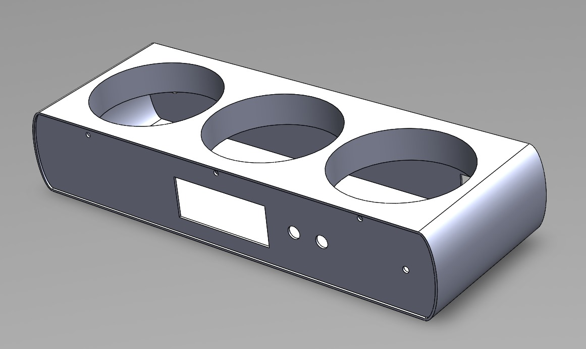

# FoodFocus

<h2>By <a href="https://github.com/linukaratnayake">Linuka Ratnayake</a>, <a href="https://github.com/YasiruDEX">Yasiru Basnayake</a>, <a href="https://github.com/KavinduJ2001">Kavindu Jayathissa</a>, <a href="https://github.com/KumuthuDeZoysa">Kumuthu De Zoysa</a></h2>

    

FoodFocus is a device designed to track and analyze the consumption of sugar, salt, and cooking oil for individuals or groups. Developed as part of the EN1190: Engineering Design Project module at the Department of Electronic and Telecommunication Engineering, University of Moratuwa, this device aims to provide an effective solution for monitoring dietary intake to promote healthier eating habits.

## Motivation
A public survey revealed that while most people are aware of the health risks associated with the over-consumption of sugar, salt, and cooking oil, there is a lack of rigorous methods to measure their consumption. To address this gap, our team worked for about five months to develop FoodFocus, a comprehensive solution for tracking these dietary components.

## Features
- Weight Measurement: Utilizes load cells to measure the weights of the compartments containing sugar, salt, and cooking oil.
- Consumption Calculation: Manipulate load cell data to calculate daily consumption.
- Daily Tracking: Keeps track of daily consumption and indicates when the daily limit is reached.
- Trend Analysis: Provides detailed reports on consumption trends over time.
- Clock and Alarm: Functions as a clock and includes alarm settings to notify when food has been cooked for the required amount of time.

## PCB Design
The PCB is designed as a two-layer board using **Altium Designer**

    

    

Schematics and PCB Design files can be found <a href="PCB Design">here</a>.

## Enclosure Design
Enclosure is designed using **SOLIDWORKS**

    

Solidworks files can be found <a href="Enclosure">here</a>.

